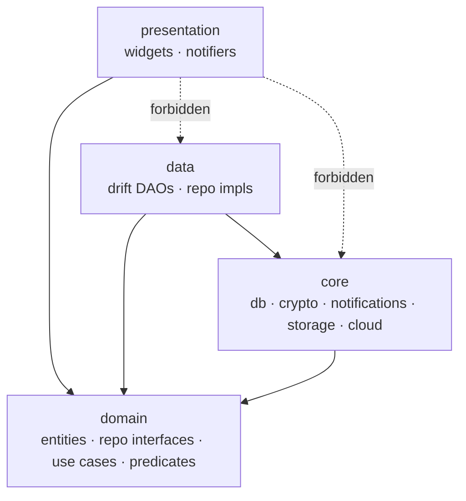
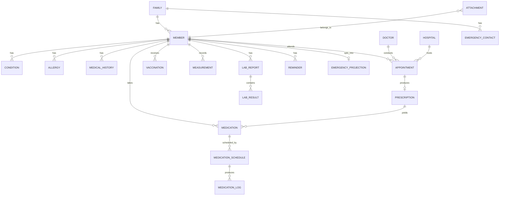
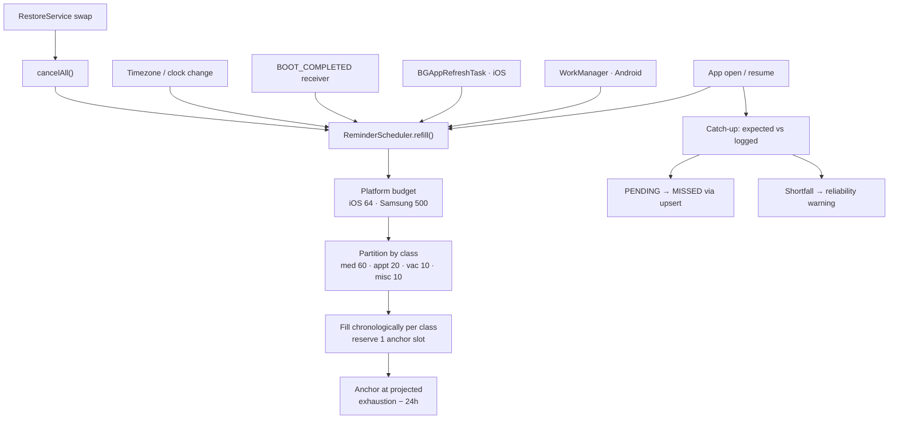

# Architecture Spine — Jotno

## Design Paradigm

**Feature-first Clean Architecture, three layers.** Each feature owns a vertical slice; layers are directories inside it.

| Layer | Contains | May depend on |
| --- | --- | --- |
| `presentation/` | Widgets, screens, Riverpod notifiers | domain |
| `domain/` | Entities, repository *interfaces*, use cases, predicates | nothing |
| `data/` | Drift tables + DAOs, repository *implementations*, mappers | domain |

Three layers, not four. **Use-case classes exist only for operations spanning more than one repository or carrying non-trivial rules** — reminder scheduling, restore, import, PDF assembly, adherence computation. Plain CRUD calls the repository directly from a notifier. A use case that only forwards one repository call is a defect, not a convention.



`presentation` never imports `data` or `core`. `domain` declares interfaces, `data` implements them, Riverpod wires them.

## Invariants & Rules

### AD-1 — The local database is the only source of truth [ADOPTED]

- **Binds:** all
- **Prevents:** a feature reading cloud state directly and diverging from what the UI shows
- **Rule:** Every read that renders UI comes from the local Drift database, with the single exception of the emergency projection (AD-21). Cloud is written and read *only* by `BackupService` and `RestoreService`, which land results in the local DB before anything renders. No widget, notifier or repository may call a cloud API.

### AD-2 — Encrypted database, verified at runtime

- **Binds:** FR-40, NFR-S1, NFR-S3
- **Prevents:** shipping a silently unencrypted database because a build flag was wrong
- **Rule:** SQLite opens through `package:sqlite3` 3.x with SQLite3MultipleCiphers via Dart hooks (`sqlcipher_flutter_libs` and `sqlite3_flutter_libs` are discontinued — do not add them). On every start, before any query, `DatabaseService` asserts the `cipher` pragma responds; if it does not, the app **fails closed** with an explicit error and does not open the database. An integration test asserts the same against a release build.

### AD-3 — The data key is double-wrapped; Keystore loss is recoverable without a backup

- **Binds:** FR-40, FR-45, FR-46, FR-47
- **Prevents:** permanent, unrecoverable data loss when Android Keystore drops a key on restore, uninstall or OS update
- **Rule:** A random Data Encryption Key encrypts the database. The DEK is stored **twice**, wrapped by two independent Key Encryption Keys: one held in platform secure storage (the fast path) and one derived from the recovery phrase via KDF. Both wrapped copies sit beside the database. Losing secure storage therefore costs a prompt, not the data — the phrase alone reconstructs the DEK, with no backup file involved. The recovery phrase is generated at first launch and the app carries a persistent, non-dismissible reminder until the user confirms they have saved it. `FlutterSecureStorage.xml` is excluded from Android auto-backup in the manifest. No code may assume secure storage survives.

### AD-4 — Every entity carries sync-ready identity from day one

- **Binds:** all persisted entities
- **Prevents:** a schema migration later blocking multi-device sync (PRD §10.2's highest-value deferral)
- **Rule:** Every table has `id TEXT` (client-generated UUIDv7, never autoincrement), `created_at`, `updated_at`, `deleted_at`, `device_id`. No hard delete from application code — `deleted_at` is set instead. The two permanent-erasure paths of FR-44 are the only exceptions and live in one place. Natural-key uniqueness constraints (AD-26) are additional to the UUID, never a replacement.

### AD-5 — One repository owns one entity, and ownership is named here

- **Binds:** all
- **Prevents:** two features writing the same table with different required fields or different rules
- **Rule:** Each entity has exactly one owning repository. Where two features could plausibly claim one, ownership is fixed by this table and is not renegotiable in code:

| Entity | Owner | Other features may |
| --- | --- | --- |
| `Prescription` | `features/medications` | link to it (appointments, documents) — never create with a different required-field set |
| `Attachment` | `core/storage` (`AttachmentStore`) | request attach/detach; never write rows or paths directly |
| `MedicationLog` | `features/medications` | write only via its upsert (AD-26) |
| `Doctor`, `Hospital` | `features/medical_records` | reference by id |
| `EmergencyContact` | `features/emergency` | read only |
| `Member` | `features/members` | reference by id |

A feature needing another's entity depends on that repository's interface through `domain`, never on its DAO or table. Cross-entity writes go through a use case opening one transaction.

### AD-6 — All writes are transactional and go through a repository

- **Binds:** FR-44, FR-47, FR-58, FR-59, FR-60
- **Prevents:** partially-written health records
- **Rule:** No DAO call outside `data/`. Any operation touching more than one row or table runs inside a Drift transaction. Import, restore and delete-all are single transactions — they commit whole or roll back whole.

### AD-7 — Reminder scheduling is budget-aware, not fixed-horizon

- **Binds:** FR-16, FR-21, FR-23, FR-25, NFR-P2
- **Prevents:** silent reminder loss when dose density exceeds the platform queue
- **Rule:** iOS caps pending notification requests at **64**; Samsung caps alarms at **500**. `ReminderScheduler` derives how far ahead it can schedule from actual density and the platform budget — never a constant. It is the **single writer** to the OS notification queue; no feature schedules directly. Budget is partitioned by priority class (AD-25).

### AD-8 — Queue refill has three tiers, and reliability is checked in-app

- **Binds:** FR-16, NFR-P2
- **Prevents:** reminders stopping without the user ever knowing
- **Rule:** Refill on (1) every app open and resume, (2) background — Android `WorkManager` periodic, iOS `BGAppRefreshTask` best-effort, (3) a reserved **coverage anchor**: one notification placed at *projected exhaustion minus 24h*, re-placed on every refill. The anchor is conditional on coverage being at risk, never a daily nag — PRD SM-C2 forbids engagement-driven frequency. The anchor covers **queue exhaustion only**; it cannot cover revoked permission or OEM suppression, because it rides the same queue. Those are caught in-app: on every open, `ReminderScheduler` compares expected deliveries since last open against `MedicationLog`, and a shortfall raises a reliability warning with a route to AD-9's remediation. Settings shows projected coverage in days.

### AD-9 — Exact-alarm and battery-exemption permissions are requested together, at first schedule

- **Binds:** FR-5, FR-16
- **Prevents:** an app that appears to work but never fires a reminder on Android 14+ or a Chinese-OEM device
- **Rule:** Declare `SCHEDULE_EXACT_ALARM`, **not** `USE_EXACT_ALARM` — Play restricts the latter to alarm/timer and calendar apps and a medication reminder does not qualify. On first Medication Schedule creation: one explanation screen, then notification permission, exact-alarm permission (`canScheduleExactAlarms()` → Alarms & reminders settings), then the battery-optimisation exemption, which also lifts the Android 14 exact-alarm denial and the OEM kill problem. `RECEIVE_BOOT_COMPLETED` plus a boot receiver reschedule everything after restart — Android erases all alarms on shutdown.

### AD-10 — Notification payloads are built at one chokepoint

- **Binds:** NFR-S2, FR-16, FR-21, FR-25
- **Prevents:** a future feature leaking dosage or diagnosis onto a lock screen
- **Rule:** All *scheduled reminder* content comes from `NotificationContentBuilder`, which accepts member name, item name and time — nothing else. Dosage, condition, lab values and document names are not parameters, so they cannot be passed. A test asserts the builder's public surface. The emergency surface of FR-38 is **not** a reminder and does not use this builder; it is governed by AD-21.

### AD-11 — Health data never reaches logs, analytics or crash reports

- **Binds:** NFR-S1, PRD §6 Privacy
- **Prevents:** the privacy claim failing through a debug statement
- **Rule:** No `print`, no raw `debugPrint` — logging goes through `AppLogger`, which accepts an event name and typed non-PII fields only. Analytics uses a compile-time allowlist of event names with no free-form parameters. `toString()` on health entities returns type and id only. A CI grep gate fails the build on direct logging calls under `features/`.

### AD-12 — Attachments live on the filesystem; the database holds metadata

- **Binds:** FR-19, FR-22, FR-33, FR-45
- **Prevents:** a multi-gigabyte SQLite file and orphaned files after delete
- **Rule:** Binary content is never a BLOB column. `AttachmentStore` is the only code that constructs attachment paths and the only code that deletes files. Rows carry relative path, mime, size, checksum, and polymorphic `entity_type` + `entity_id`. Deleting an owning record soft-deletes the row; file removal happens only in the permanent-erasure path, driven by `AttachmentStore` reconciling against the DB.

### AD-13 — Cloud providers sit behind one interface

- **Binds:** FR-49, FR-50, FR-51, FR-52, FR-53
- **Prevents:** provider-specific auth or path logic spreading through the codebase
- **Rule:** `CloudStorageProvider` declares `connect · disconnect · upload · download · list · delete · metadata`. Google Drive (`googleapis` + `google_sign_in` 7.x — 7.0 split authorization from sign-in; scopes come from `authorizationClient.authorizeScopes`), OneDrive (MSAL + Graph REST) and Dropbox (`dropbox_client`) implement it. No provider type name appears outside its own implementation file and the registry. Adding a fourth provider touches two files.

### AD-14 — The backup package format is versioned and verified before use

- **Binds:** FR-45, FR-47, FR-48, FR-52, FR-60
- **Prevents:** a corrupt or newer-schema archive half-restoring over good data
- **Rule:** A `.hfm` is an encrypted archive of `manifest.json` (format version, schema version, device id, counts, checksum), the database, and attachments. Restore reads the manifest and verifies the checksum **before** decrypting the payload, and refuses a schema version newer than the running app. Restore stages to a temp location and swaps only on full success (AD-6), then notifies `ReminderScheduler` to rebuild the queue (AD-24).

### AD-15 — Time is stored UTC, scheduled local, and rescheduled on shift

- **Binds:** FR-16, FR-21, FR-23, FR-25
- **Prevents:** doses firing an hour early after a timezone or DST change
- **Rule:** Timestamps persist as UTC. Schedules persist as local wall-clock time plus an IANA timezone id — a dose at 8:00 stays 8:00 after travel. `ReminderScheduler` recomputes and re-registers the whole pending queue on timezone change, system clock change and locale change.

### AD-16 — Riverpod without codegen; state mutates only in notifiers

- **Binds:** all presentation
- **Prevents:** two features inventing different state-mutation paths
- **Rule:** Manual providers, no `riverpod_generator` — Riverpod's current guidance is that codegen is not worth adopting for Riverpod alone, and Dart macros were cancelled. Widgets read state and call notifier methods; widgets never call repositories directly. One notifier per screen-level concern. **Headless entry points** (notification action handler, boot receiver, WorkManager callback) run outside the widget tree and are exempt from the notifier rule — they call repositories through a container built by `HeadlessScope`, and they are the only code permitted to do so.

### AD-17 — Schema migrations are generated and tested, never hand-written

- **Binds:** all persisted entities
- **Prevents:** data loss on upgrade — unrecoverable here, since there is no server copy
- **Rule:** Every schema change bumps `schemaVersion` and runs `drift_dev make-migrations`, which exports the versioned schema, generates `.steps.dart`, and generates migration tests. Migration tests for every version pair are mandatory in CI. Hand-written migrations are not permitted.

### AD-18 — Both languages are complete, and no string is hardcoded

- **Binds:** FR-61, FR-62, NFR-A1, NFR-A2
- **Prevents:** an English-only error dialog appearing in a Bangla build
- **Rule:** All user-facing text lives in ARB files. Bangla and English are both complete — error messages, notification text, permission rationale, disclaimer, privacy policy. CI fails on a key present in one locale and missing in the other. Numeric display uses Bengali numerals in the Bangla locale via a shared formatter; no raw `toString()` on a number reaches the UI.

### AD-19 — Paid-tier gating is evaluated in one place

- **Binds:** FR-50, FR-51, FR-52, FR-53, PRD §8
- **Prevents:** entitlement checks scattered through cloud features and drifting apart
- **Rule:** `EntitlementService` answers `hasPrivateBackup` and `isAdFree`. Cloud backup features ask it; they never read purchase state directly. Ads ask it too. The list of screens that must never show an ad — emergency card, medication reminder, active data entry — is a constant owned by the ads module. Local backup (FR-45), local restore (FR-47) and `.hfm` import (FR-60) are **never** gated (AD-30).

### AD-20 — The app functions with every optional subsystem absent

- **Binds:** NFR-P1
- **Prevents:** a cloud, ads or analytics failure blocking a health record
- **Rule:** Cloud, ads, analytics and IAP are optional subsystems, each behind an interface with a no-op implementation. The suite must pass with all four no-ops installed. No core path awaits a network call.

### AD-21 — The emergency projection is a separate, minimal, independently-encrypted store

- **Binds:** FR-36, FR-37, FR-38
- **Prevents:** the locked-device emergency card forcing either the main DEK into a widget process or plaintext health data onto disk
- **Rule:** FR-38 cannot read the main database — AD-2 fails closed and AD-3 keeps the DEK out of any other process. Instead, `EmergencyProjectionService` maintains a **separate store** containing only the FR-36 field set (name, age, blood group, allergies, active conditions, active medication names and dosages, emergency contacts) for members the user has explicitly opted in. It is encrypted with its own key, shared with the lock-screen surface via App Group keychain (iOS) / a dedicated Keystore alias (Android) — never the main DEK. It is the **only** data outside the main database, has exactly one writer, and is rewritten whenever its source data changes. Opting a member out, deleting a member, or wiping data deletes their projection synchronously in the same transaction (AD-24). No other feature may read or write it.

### AD-22 — Derived clinical state is a domain predicate, never a caller's filter

- **Binds:** FR-14, FR-24, FR-36, FR-54, FR-55
- **Prevents:** the emergency card and the doctor's PDF showing different drug lists for the same member at the same moment
- **Rule:** "Active medication", "current condition", "vaccination due", "overdue dose" each have exactly one definition, expressed as a named predicate in `domain`. `Medication` carries both `status` and `end_date`; **no caller may filter on either directly.** Every consumer — dashboard, emergency card, PDF, timeline, calendar — calls the predicate. A test asserts each predicate has exactly one implementation.

### AD-23 — Aggregators define contracts; features implement them

- **Binds:** FR-34, FR-39, FR-54, FR-55, FR-36
- **Prevents:** ten source features each inventing what a timeline row, a calendar event or a PDF section looks like
- **Rule:** Timeline, Calendar, PDF export and the emergency projection are **aggregators**. Each declares a contributor interface in `domain` (`TimelineContributor`, `CalendarContributor`, `SummaryContributor`) with a fixed output shape. A feature that appears in an aggregator implements that interface; the aggregator composes registered contributors and never imports a source feature. Adding a feature to an aggregator means implementing an interface, not editing the aggregator. Shared presentation components used across aggregators — chart, allergy badge, member chip — live in `shared/` with a single implementation; three consumers rendering the same reading three ways is the divergence this exists to stop.

### AD-24 — Notification identity is derived, and lifecycle is owned by the scheduler

- **Binds:** FR-16, FR-21, FR-25, FR-44, FR-47, FR-60
- **Prevents:** a deleted member's name surfacing on a lock screen, and a restored database logging a dose against the wrong schedule
- **Rule:** The OS notification integer id is a deterministic hash of `(entity_type, entity_id, scheduled_utc)` — never a counter, never random, so it is reproducible without stored state. `ReminderScheduler` exposes `cancelFor(entityType, entityId)` and is called **inside the same transaction** that deletes a member, deletes or pauses a medication, or cancels an appointment. `RestoreService` calls `cancelAll()` then `refill()` as part of the restore swap — the queue is never allowed to reference ids from a replaced database.

### AD-25 — Reminder budget is partitioned by priority class

- **Binds:** FR-16, FR-21, FR-23, FR-25, NFR-P2
- **Prevents:** a dense medication schedule consuming every iOS slot so an appointment reminder is never scheduled at all
- **Rule:** The platform budget is partitioned before filling: **medication 60% · appointment 20% · vaccination 10% · standalone 10%**, with a reserved anchor slot (AD-8). Unused capacity in a class is lent to medication, never the reverse. Within a class, chronological. If a class cannot fit an item within its horizon, the app **tells the user at creation time** that the reminder may not fire without opening the app — a reminder is never silently dropped.

### AD-26 — MedicationLog has a natural key and one write path

- **Binds:** FR-17, FR-18
- **Prevents:** duplicate rows from the three independent writers pushing adherence above 100%
- **Rule:** `medication_logs` carries a unique constraint on `(schedule_id, scheduled_time)` in addition to its UUID. The three writers — notification action handler, medications screen, catch-up reconciliation — all call one repository method, `upsertLog`, which resolves by natural key. Reconciliation may only transition `PENDING → MISSED`; it may never overwrite a user-supplied outcome.

### AD-27 — Performance budgets are asserted against a committed fixture

- **Binds:** NFR-P3..NFR-P9
- **Prevents:** nine numeric budgets that nothing measures
- **Rule:** The PRD's reference dataset — 10 members, 20 years, 10,000 measurements, 10,000 medication logs, 5,000 documents, 500 appointments — exists as a generated test fixture committed to the repo. Every NFR-P budget has a benchmark test running against it, and the benchmarks run in CI on a fixed profile. Repositories serving list surfaces (timeline, calendar, documents, logs) expose **paged** queries only; an unpaged `getAll` on a growing table is a defect.

### AD-28 — Navigation is typed and deep links are a declared contract

- **Binds:** FR-16, FR-21, FR-37, FR-39
- **Prevents:** notification taps and cross-feature jumps each inventing their own route strings
- **Rule:** `go_router` with typed routes declared in `app/router.dart`. Every route reachable from outside the widget tree — a notification tap, a calendar event, the emergency shortcut — has a declared deep-link path, and the notification payload carries that path, not a feature-local identifier. Route shape follows EXPERIENCE.md: five root tabs, sheets stack one level, never two. A feature may not construct another feature's route string by hand.

### AD-29 — The accessibility floor is enforced by shared components

- **Binds:** NFR-A1, NFR-A2
- **Prevents:** the 48px target and no-truncation rules holding on the screens someone remembered and failing elsewhere
- **Rule:** Tappable rows, buttons and controls come from `shared/` components carrying the 48px minimum; a bare `GestureDetector` on a raw container in `features/` is a defect. Text that renders user data uses components that wrap rather than ellipsise — a truncated medication or member name is a safety defect, not a cosmetic one. Every icon-only control takes a required semantic label parameter, so omitting one fails compilation. Widget tests assert layout integrity at the largest dynamic-type setting.

### AD-30 — Entitlement never blocks recovery of the user's own data

- **Binds:** FR-45, FR-47, FR-52, FR-60, PRD §10.1a
- **Prevents:** a user on a replacement phone being refused their own backup because the purchase state has not resolved
- **Rule:** `EntitlementService` returns a tri-state — `entitled · notEntitled · unknown` — and the no-op implementation returns `unknown`, never `notEntitled`. Recovery paths treat `unknown` as permitted. Local backup, local restore and `.hfm` file import are permanently free and carry no entitlement check at all, so a user can always recover from a file they hold. Only *creating and browsing cloud* backups is gated.

## Consistency Conventions

| Concern | Convention |
| --- | --- |
| Entities | Singular PascalCase (`FamilyMember`, `MedicationSchedule`) matching PRD §3 Glossary exactly |
| Tables | Plural snake_case (`family_members`, `medication_schedules`) |
| Files | snake_case; `features/<feature>/{presentation,domain,data}/` |
| Repository | `<Entity>Repository` interface in `domain/`, `<Entity>RepositoryImpl` in `data/` |
| Providers | `<thing>Provider`; notifiers `<Screen>Notifier` |
| Predicates | `is<State>(entity)` in `domain/predicates.dart`, one implementation each (AD-22) |
| Contributors | `<Aggregator>Contributor` implemented in the source feature's `domain/` (AD-23) |
| Ids | UUIDv7, client-generated, `TEXT` |
| Notification ids | Deterministic hash of `(entity_type, entity_id, scheduled_utc)` (AD-24) |
| Dates | UTC ISO-8601 in storage; local wall-clock + IANA tz for schedules |
| Money | Minor units as `int`, never `double` |
| Errors | `Result<T, AppFailure>` across layer boundaries; exceptions never reach `presentation` |
| Failures | Sealed `AppFailure` carrying a localisation key — every failure presentable in both languages |
| Logging | `AppLogger` only; event name + typed non-PII fields |
| Config | Compile-time via `--dart-define`; no secrets in the repo |
| Enums | Persisted as `TEXT` matching the Dart name, never ordinal |
| Queries | Paged by default on any table that grows (AD-27) |

## Stack

Verified current 2026-08-30. The code owns these once it exists.

| Name | Version |
| --- | --- |
| Flutter | 3.47 |
| drift | 2.34.3 |
| package:sqlite3 | 3.5.2 (SQLite3MultipleCiphers via Dart hooks) |
| flutter_riverpod | 3.4.2 |
| go_router | 18.0.0 |
| freezed | 4.0.1 |
| json_serializable | 6.14.1 |
| intl | 0.20.3 |
| flutter_secure_storage | 11.0.0 |
| flutter_local_notifications | 22.3.0 |
| workmanager | 0.10.9 |
| timezone | 0.11.1 |
| google_mobile_ads | 9.1.0 (UMP bundled) |
| googleapis | 17.0.0 |
| google_sign_in | 7.2.0 |
| msal_auth | 3.5.3 |
| dropbox_client | 1.2.2 |
| Android compileSdk / targetSdk / minSdk | 35 / 34 / 23 |
| AGP | 8.11.1 |

**Do not add:** `sqlcipher_flutter_libs`, `sqlite3_flutter_libs` (discontinued), `riverpod_generator` (AD-16).

**Recent major bumps — read the changelog before adopting:** `go_router` 18.0.0, `freezed` 4.x and `googleapis` 17.x all shipped within days of this spine. `workmanager` 0.10.x is now federated (`workmanager_android`, `workmanager_apple`) under the Flutter Community publisher; Android clamps periodic tasks to a 15-minute floor, which AD-8 tier 2 must assume. `flutter_localizations` ships with the SDK, not pub.

Every version above was checked against pub.dev on 2026-08-30. The lockfile owns them thereafter.

## Structural Seed

```text
lib/
  app/            # entry, typed router (AD-28), theme, localisation delegates
  core/
    database/     # Drift db, migrations, cipher assertion (AD-2)
    crypto/       # DEK double-wrap, recovery phrase, backup encryption (AD-3)
    notifications/# ReminderScheduler, ContentBuilder, boot + permissions (AD-7..10, AD-24, AD-25)
    storage/      # AttachmentStore (AD-12), secure storage wrapper
    cloud/        # CloudStorageProvider + 3 impls (AD-13)
    backup/       # package format, backup/restore (AD-14)
    emergency/    # EmergencyProjectionService (AD-21)
    logging/      # AppLogger, analytics allowlist (AD-11)
    entitlement/  # EntitlementService, tri-state (AD-19, AD-30)
    headless/     # HeadlessScope for non-widget entry points (AD-16)
    result/       # Result, AppFailure
  shared/         # cross-aggregator widgets: chart, allergy badge, member chip,
                  # a11y-compliant row/button primitives (AD-23, AD-29)
  features/
    onboarding/ family/ members/ medical_records/ medications/
    appointments/ vaccinations/ measurements/ lab_reports/ documents/
    timeline/ calendar/ emergency/ reminders/ security/
    backup_sync/ import_export/ settings/
  l10n/           # app_bn.arb, app_en.arb (AD-18)
test/
  fixtures/       # generated reference dataset (AD-27)
```



Every entity carries the AD-4 identity columns. Attachments are polymorphic by `entity_type` + `entity_id`. `EMERGENCY_PROJECTION` lives outside the main database (AD-21).



**Operational envelope.** No servers and no environments to promote between — the deployable is the store binary. CI runs analyze, unit tests, migration tests (AD-17), the release-build cipher assertion (AD-2), the l10n parity check (AD-18), the logging grep gate (AD-11), and the NFR-P benchmarks against the committed fixture (AD-27). Release channels: Play internal → closed → production; TestFlight → App Store. Crash reporting is OS-level only and carries no health data by AD-11. Optional runtime dependencies — AdMob, Firebase Analytics, the user's cloud provider — are all covered by AD-20.

## Capability → Architecture Map

Verified against the PRD's FR headings.

| FR | Capability | Lives in | Governed by |
| --- | --- | --- | --- |
| FR-1..FR-5 | Welcome, disclaimer, ad consent, privacy policy, permissions | `features/onboarding` | AD-9, AD-18 |
| FR-6..FR-8 | Family creation, members, member dashboard | `features/family`, `features/members` | AD-4, AD-5, AD-22 |
| FR-9..FR-11 | Medical history, conditions, allergies | `features/medical_records` | AD-5, AD-6, AD-22 |
| FR-12..FR-13 | Doctor and hospital directories | `features/medical_records` | AD-5 |
| FR-14..FR-18 | Medications, schedules, engine, dose logging, adherence | `features/medications`, `core/notifications` | AD-7, AD-8, AD-9, AD-10, AD-15, AD-24, AD-25, AD-26 |
| FR-19 | Prescriptions | `features/medications` | AD-5, AD-12 |
| FR-20..FR-22 | Appointments, reminders, post-visit notes | `features/appointments` | AD-7, AD-15, AD-24, AD-25 |
| FR-23 | Standalone reminders | `features/reminders` | AD-7, AD-25 |
| FR-24..FR-25 | Vaccinations and their reminders | `features/vaccinations` | AD-7, AD-22, AD-25 |
| FR-26..FR-29 | Measurements, BP, glucose, trend charts | `features/measurements`, `shared/` | AD-5, AD-23, AD-27 |
| FR-30..FR-32 | Lab reports, results, history | `features/lab_reports`, `shared/` | AD-5, AD-23 |
| FR-33 | Document vault | `features/documents` | AD-12, AD-27 |
| FR-34 | Health timeline | `features/timeline` | AD-23, AD-27 |
| FR-35 | Emergency contacts | `features/emergency` | AD-5 |
| FR-36..FR-37 | Emergency card content and access | `features/emergency` | AD-21, AD-22, AD-23 |
| FR-38 | Rapid access without app unlock | `core/emergency` | AD-21, AD-28 |
| FR-39 | Family health calendar | `features/calendar` | AD-23, AD-27, AD-28 |
| FR-40..FR-43 | Encrypted DB, PIN, biometric, auto-lock | `core/crypto`, `features/security` | AD-2, AD-3 |
| FR-44 | Data deletion | `features/settings`, `core/storage` | AD-4, AD-6, AD-12, AD-24 |
| FR-45..FR-48 | Local backup, recovery phrase, restore, failure handling | `core/backup`, `core/crypto` | AD-3, AD-14, AD-30 |
| FR-49 | Cloud connection lifecycle | `core/cloud` | AD-13 |
| FR-50..FR-53 | Cloud backup, restore, automatic backup (paid) | `core/cloud`, `features/backup_sync` | AD-13, AD-19, AD-30 |
| FR-54..FR-55 | PDF health summary, family report | `features/import_export` | AD-22, AD-23, AD-27 |
| FR-56..FR-57 | CSV and JSON export | `features/import_export` | AD-6 |
| FR-58..FR-60 | CSV, JSON and backup-file import | `features/import_export` | AD-6, AD-14, AD-30 |
| FR-61..FR-62 | Bangla-default and English UI | `l10n`, `app/` | AD-18, AD-29 |

## Deferred

| Deferred | Why it can wait |
| --- | --- |
| Multi-device sync engine — conflict detection, merge, change-log transport | AD-4 makes the schema sync-ready, which is the expensive part to retrofit. The engine needs a product decision on conflict UX that MVP does not force. |
| Sync conflict resolution policy | Depends on the engine; PRD §10.2 already forbids silent auto-resolution of health-record conflicts. |
| OCR, on-device AI, drug interaction data | Out of MVP scope; each brings a third-party dependency this altitude should not bind. |
| iOS rapid-access surface (widget vs. Live Activity vs. App Intent) | AD-21 fixes *what data may exist outside the main database and who owns it* — the invariant. Which iOS affordance renders it is a leaf choice best made against a device. |
| PDF rendering library | AD-23 fixes the contract and NFR-P8 the budget; any library meeting both is compliant. |
| Test-coverage thresholds and mocking strategy | Team convention. The mandatory gates are named in the operational envelope. |
| Analytics event taxonomy beyond the allowlist mechanism | AD-11 fixes the mechanism; which events exist is a product question. |
| CI provider and release automation | No servers to coordinate; any provider running the named gates is compliant. |

## Open Questions

1. **iOS background refill reliability.** `BGAppRefreshTask` is throttled and not guaranteed. AD-8's anchor plus the in-app shortfall check are the designed fallbacks, but the real-world refill rate needs measuring on device — it determines how often users see the anchor.
2. **Slot-budget calibration.** [ASSUMPTION] ~12 doses/day typical, ~30/day heavy, and the AD-25 partition ratios follow from it. If real families run denser, iOS coverage drops below three days routinely. Instrument coverage-days and revisit both the assumption and the ratios.
3. **Battery-exemption acceptance rate.** AD-9 depends on users accepting an unfamiliar system prompt. Low acceptance on Xiaomi/Oppo would mean reminder reliability suffers and the prompt copy or timing needs rework.
